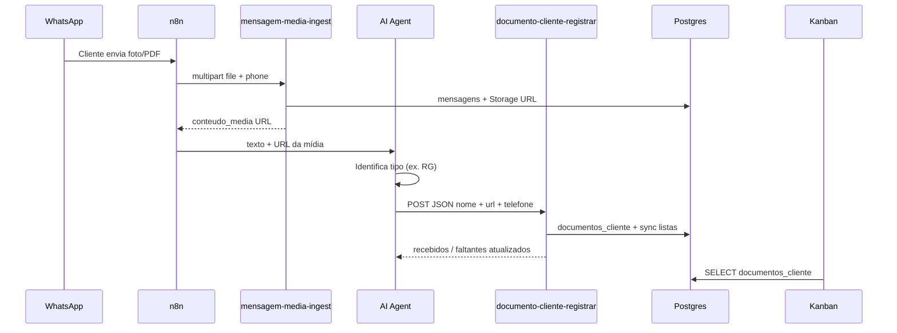

# Fluxo de documentos do cliente (IA → painel)

Quando o cliente envia foto/PDF pelo WhatsApp, a mídia já é salva no chat via `mensagem-media-ingest`. Depois que a IA **identifica** o documento (ex.: RG, CPF, certidão), ela chama a tool **`registrar_documento_cliente`**, que grava o vínculo no caso e atualiza o que falta.

## Diagrama



## Endpoint (tool da IA)

**Recomendado:** use a API do painel com token em `app_config.n8n_integracao_token` ou variável de ambiente `N8N_INTEGRACAO_TOKEN`.

| Item | Valor |
|------|--------|
| URL | `https://SEU-DOMINIO/api/integracao/documento-registrar` |
| Método | `POST` |
| Content-Type | `application/json` |
| Auth | `x-integracao-token: <token do app_config ou N8N_INTEGRACAO_TOKEN>` |

**Alternativa direta Supabase** (legado):

| Item | Valor |
|------|--------|
| URL | `https://hzfvciamevimjzuvidcp.supabase.co/functions/v1/documento-cliente-registrar` |
| Auth | `Authorization: Bearer <SERVICE_ROLE>` + `apikey: <SERVICE_ROLE>` |

### Body JSON (campos da tool)

| Campo | Obrigatório | Descrição |
|-------|-------------|-----------|
| `nome_documento` | sim | Nome legível: `RG`, `CPF`, `Certidão de casamento`, etc. |
| `url_media` | sim | URL pública retornada por `mensagem-media-ingest` (`conteudo_media`) |
| `descricao` | não | Detalhe: `RG frente e verso`, `Laudo médico de 2024` |
| `telefone_cliente` | sim* | Telefone do cliente (mesmo do `mapear_dados`) |
| `cpf` | não | CPF se já coletado na triagem |
| `caso_id` | não | ID do caso se já conhecido |
| `mensagem_id` | não | ID Evolution da mensagem |
| `mensagem_row_id` | não | `id` numérico da linha em `mensagens` |

\* Obrigatório **telefone**, **cpf** ou **caso_id** (pelo menos um).

### Exemplo de body

```json
{
  "nome_documento": "RG",
  "descricao": "Documento de identidade enviado pelo cliente no WhatsApp",
  "url_media": "https://hzfvciamevimjzuvidcp.supabase.co/storage/v1/object/public/mensagens-media/5519981941604/3BAFB160.jpg",
  "telefone_cliente": "5519981941604",
  "cpf": "12345678901",
  "mensagem_id": "3BAFB1605E757CCB9F64"
}
```

### Resposta 200

```json
{
  "documento_id": 1,
  "caso_id": 1,
  "documentos_recebidos": "RG, CPF, autodeclaração rural",
  "documentos_faltantes": "CAF/DAP, notas de venda de produção",
  "message": "Documento registrado com sucesso"
}
```

### Erros comuns

| Status | Motivo |
|--------|--------|
| 401 | Service role inválida |
| 404 | Caso não encontrado — só ocorre se faltar telefone/cpf/caso_id |
| 400 | Falta `nome_documento`, `url_media` ou identificador do cliente |

## O que o sistema faz

1. Localiza o caso em `casos_novos` por `caso_id`, `cpf` ou `telefone` (caso mais recente não encerrado). Se não existir, **cria um rascunho** com o telefone.
2. Insere em `documentos_cliente` (nome, descrição, URL, vínculo com mensagem).
3. Adiciona o nome em `documentos_recebidos` e remove de `documentos_faltantes` (match sem diferenciar maiúsculas).
4. O Kanban mostra cards com link **Abrir** para cada arquivo.

## n8n — tool HTTP Request (recomendado)

Copie a URL abaixo e o token de `app_config` (ou `N8N_INTEGRACAO_TOKEN` no `.env`). O n8n **não** precisa da service_role do Supabase.

| Campo | Valor |
|-------|--------|
| **Name** | `registrar_documento_cliente` |
| **Description** | Use quando o cliente enviar foto ou PDF e você identificar qual documento é (RG, CPF, certidão, laudo, etc.). Envia a URL da mídia já salva, o nome e uma descrição. Atualiza o que já foi recebido e o que ainda falta. Chame assim que identificar — não espere o fim da triagem. |
| **Method** | POST |
| **URL** | `https://SEU-DOMINIO/api/integracao/documento-registrar` |
| **Headers** | `x-integracao-token: <N8N_INTEGRACAO_TOKEN ou app_config>`, `Content-Type: application/json` |
| **Body JSON** | ver abaixo |

**Body (expressions n8n):**

```json
{
  "nome_documento": "={{ $fromAI('nome_documento', 'Nome do documento identificado, ex: RG, CPF, Certidão de óbito', 'string') }}",
  "descricao": "={{ $fromAI('descricao', 'Descrição curta do que foi enviado', 'string') }}",
  "url_media": "={{ $fromAI('url_media', 'URL pública da mídia (conteudo_media do ingest)', 'string') }}",
  "telefone_cliente": "={{ $('mapear_dados').first().json.telefone }}",
  "nome_cliente": "={{ $fromAI('nome_cliente', 'Nome do cliente se já informado', 'string') }}",
  "cpf": "={{ $fromAI('cpf', 'CPF do cliente se já informado, senão vazio', 'string') }}",
  "mensagem_id": "={{ $('mapear_dados').first().json.messageId }}"
}
```

**Dica no prompt da IA** — inclua no `<triagem-caso-novo>`:

```
Quando o cliente enviar foto ou PDF:
1. Use a URL em <InfoUser> (conteudo_media).
2. Identifique o tipo de documento.
3. Chame registrar_documento_cliente com nome_documento, url_media, descricao e telefone.
4. Confirme ao cliente que o documento foi recebido e registre o que ainda falta.
```

## Tabela `documentos_cliente`

| Coluna | Uso |
|--------|-----|
| `caso_id` | Caso em `casos_novos` |
| `nome_documento` | RG, CPF, etc. |
| `descricao` | Texto livre da IA |
| `url_media` | Link no Storage (`mensagens-media`) |
| `mensagem_id` | ID Evolution (dedup opcional) |
| `origem` | `whatsapp` (default) |

## Checklist

- [ ] `mensagem-media-ingest` rodando antes da IA (URL disponível)
- [ ] Caso criado em `casos_novos` (triagem iniciada ou `registrar_caso_para_advogado`)
- [ ] Tool `registrar_documento_cliente` no agente
- [ ] Prompt instrui IA a chamar a tool ao receber mídia
- [ ] Kanban → detalhe do caso mostra arquivos com link
