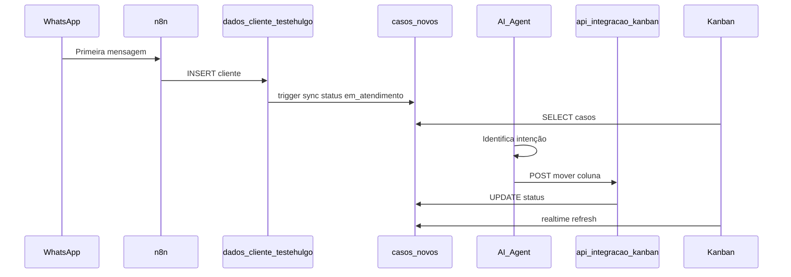

# Fluxo do funil Kanban (IA → painel)

Quando o cliente entra pelo WhatsApp, o n8n cadastra em `dados_cliente_testehulgo` e o trigger cria automaticamente um card em **Em atendimento** no Kanban. Conforme a IA identifica a intenção, ela chama `mover_cliente_kanban` para mover o cliente entre colunas.

## Diagrama



## Colunas do funil

| Valor DB | Coluna no painel |
|----------|------------------|
| `em_atendimento` | Em atendimento |
| `consultar_processo` | Consultar processo |
| `abertura_processo` | Abertura de processo |
| `aguardando_aprovacao` | Aguardando aprovação |
| `atendimento_humano` | Solicitou atendimento humano |
| `processo_finalizado` | Processo finalizado |

## Endpoints (tools da IA)

### Consultar posição — `consultar_cliente_kanban`

| Item | Valor |
|------|--------|
| URL | `https://SEU-DOMINIO/api/integracao/kanban-consultar` |
| Método | `POST` |
| Auth | `x-integracao-token: <N8N_INTEGRACAO_TOKEN>` |

Body: `{ "telefone_cliente": "5519981941604" }`

### Mover coluna — `mover_cliente_kanban`

| Item | Valor |
|------|--------|
| URL | `https://SEU-DOMINIO/api/integracao/kanban-mover` |
| Método | `POST` |
| Content-Type | `application/json` |
| Auth | `x-integracao-token: <N8N_INTEGRACAO_TOKEN ou app_config.n8n_integracao_token>` |

### Body JSON

| Campo | Obrigatório | Descrição |
|-------|-------------|-----------|
| `telefone_cliente` | sim | Telefone do cliente (mesmo do `mapear_dados`) |
| `coluna` | sim | Um dos 6 status da tabela acima |
| `motivo` | não | Breve motivo da movimentação (1 frase) |
| `nome_cliente` | não | Nome do cliente se já informado |

### Exemplo de body

```json
{
  "telefone_cliente": "5519981941604",
  "coluna": "consultar_processo",
  "motivo": "Cliente quer consultar aposentadoria rural",
  "nome_cliente": "Maria Silva"
}
```

### Resposta 200

```json
{
  "caso_id": 1,
  "status": "consultar_processo",
  "telefone": "5519981941604",
  "message": "Cliente movido no funil com sucesso"
}
```

## n8n — HTTP Request Tools

Ver arquivo completo com todas as tools e prompt: **[N8N-TOOLS-PROMPT.md](./N8N-TOOLS-PROMPT.md)**

### `consultar_cliente_kanban`

| Campo | Valor |
|-------|--------|
| **Method** | POST |
| **URL** | `https://SEU-DOMINIO/api/integracao/kanban-consultar` |

### `mover_cliente_kanban`
| **Description** | Use para mover o cliente no funil do escritório conforme a intenção identificada na conversa. Colunas permitidas: em_atendimento, consultar_processo, abertura_processo, aguardando_aprovacao, atendimento_humano, processo_finalizado. Chame quando a intenção mudar ou ficar clara — não a cada mensagem. em_atendimento: cliente novo ou ainda sem intenção definida (geralmente automático no primeiro cadastro). consultar_processo: quer saber andamento de processo existente. abertura_processo: quer entrar com pedido/benefício novo. aguardando_aprovacao: após enviar resumo para o advogado aprovar (consulta de processo). atendimento_humano: pediu falar com advogado/humano. processo_finalizado: caso encerrado ou processo já aberto/concluído pela equipe. |
| **Method** | POST |
| **URL** | `https://SEU-DOMINIO/api/integracao/kanban-mover` |
| **Headers** | `x-integracao-token: <N8N_INTEGRACAO_TOKEN>`, `Content-Type: application/json` |

**Body (expressions n8n):**

```json
={
  "telefone_cliente": "{{ $('mapear_dados').first().json.telefone }}",
  "coluna": {{ $fromAI('coluna', 'Status do funil: em_atendimento | consultar_processo | abertura_processo | aguardando_aprovacao | atendimento_humano | processo_finalizado', 'string') }},
  "motivo": {{ $fromAI('motivo', 'Breve motivo da movimentação, 1 frase', 'string') }},
  "nome_cliente": {{ $fromAI('nome_cliente', 'Nome do cliente se já informado', 'string') }}
}
```

## Trecho de prompt para o AI Agent

Ver bloco completo `<funil-kanban>` em **[N8N-TOOLS-PROMPT.md](./N8N-TOOLS-PROMPT.md)** — inclui consultar antes de mover.

## Integração com tools existentes

- `enviar_para_aprovacao_advogado` → em seguida chamar `mover_cliente_kanban` com `aguardando_aprovacao`
- `registrar_caso_para_advogado` → garantir `abertura_processo` (se ainda não estiver)
- Falar com advogado → `atendimento_humano`

## Checklist

- [ ] Cliente cadastrado em `dados_cliente_testehulgo` (card automático em Em atendimento)
- [ ] Tools `consultar_cliente_kanban` e `mover_cliente_kanban` no agente n8n
- [ ] Token configurado (`N8N_INTEGRACAO_TOKEN` ou `app_config`)
- [ ] Prompt com bloco `<funil-kanban>`
- [ ] Kanban no painel mostra card e atualiza em realtime
