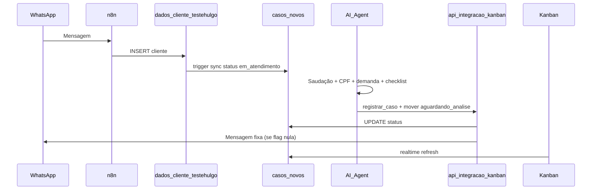

# Fluxo do funil Kanban (IA organizadora → painel)

Quando o cliente entra pelo WhatsApp, o n8n cadastra em `dados_cliente_testehulgo` e o trigger cria automaticamente um card em **Em atendimento** no Kanban. A IA organiza (CPF, demanda, checklist de docs) e move para **Aguardando análise** — caixa de pendências da equipe. A mensagem fixa de encaminhamento é enviada uma vez (API/painel; flag `mensagem_encaminhamento_enviada_em`).

## Diagrama


```mermaid
sequenceDiagram
  participant WA as WhatsApp
  participant n8n as n8n
  participant Dados as dados_cliente_testehulgo
  participant DB as casos_novos
  participant IA as AI_Agent
  participant API as api_integracao_kanban
  participant UI as Kanban

  WA->>n8n: Mensagem
  n8n->>Dados: INSERT cliente
  Dados->>DB: trigger sync status em_atendimento
  IA->>IA: Saudação + CPF + demanda + checklist
  IA->>API: registrar_caso + mover aguardando_analise
  API->>DB: UPDATE status
  API->>WA: Mensagem fixa (se flag nula)
  UI->>DB: realtime refresh
```

## Colunas do funil

| Valor DB | Coluna no painel |
|----------|------------------|
| `em_atendimento` | Em atendimento |
| `consultar_processo` | Consultar processo |
| `abertura_processo` | Abertura de processo |
| `aguardando_analise` | Aguardando análise |
| `aguardando_aprovacao` | Aguardando aprovação |
| `atendimento_humano` | Solicitou atendimento humano |
| `processo_finalizado` | Processo finalizado |

**Fase 1 (organizador):** destino padrão após organização = `aguardando_analise`. Não misturar com `abertura_processo` (ainda coleta) nem com `aguardando_aprovacao` (aprovação de texto WhatsApp — fase 2).

## Mensagem fixa ao entrar em `aguardando_analise`

Texto (obrigatório, sem variar):

> Recebemos suas informações. Sua solicitação foi encaminhada para análise. Aguarde, que em breve retornaremos com a resposta.

- **Painel:** ao mover card para essa coluna, `updateCasoStatusCliente` chama `enviarEncaminhamentoAnaliseSePendente`.
- **n8n:** `POST /api/integracao/kanban-mover` com `coluna: aguardando_analise` dispara o mesmo envio se a flag estiver nula.
- **Anti-duplicata:** coluna `casos_novos.mensagem_encaminhamento_enviada_em`.

Ver também [PROMPT-AGENTE-IA.md](./PROMPT-AGENTE-IA.md) (opcional sendText no subfluxo `registrar_caso_para_advogado`).

## Endpoints (tools da IA)

### Consultar posição — `consultar_cliente_kanban`

| Item | Valor |
|------|--------|
| URL | `https://SEU-DOMINIO/api/integracao/kanban-consultar` |
| Método | `POST` |
| Auth | `x-integracao-token: <N8N_INTEGRACAO_TOKEN>` |

Body: `{ "telefone_cliente": "5519981941604" }`

### Mover coluna — `mover_cliente_kanban`

| Item | Valor |
|------|--------|
| URL | `https://SEU-DOMINIO/api/integracao/kanban-mover` |
| Método | `POST` |
| Content-Type | `application/json` |
| Auth | `x-integracao-token: <N8N_INTEGRACAO_TOKEN ou app_config.n8n_integracao_token>` |

### Body JSON

| Campo | Obrigatório | Descrição |
|-------|-------------|-----------|
| `telefone_cliente` | sim | Telefone do cliente (mesmo do `mapear_dados`) |
| `coluna` | sim | Um dos status da tabela acima |
| `motivo` | não | Breve motivo da movimentação (1 frase) |
| `nome_cliente` | não | Nome do cliente se já informado |

### Exemplo de body

```json
{
  "telefone_cliente": "5519981941604",
  "coluna": "aguardando_analise",
  "motivo": "Organização concluída — encaminhado para análise",
  "nome_cliente": "Maria Silva"
}
```

### Resposta 200

```json
{
  "caso_id": 1,
  "status": "aguardando_analise",
  "telefone": "5519981941604",
  "message": "Cliente movido no funil com sucesso",
  "mensagem_encaminhamento_enviada": true
}
```

## n8n — HTTP Request Tools

Ver arquivo completo: **[N8N-TOOLS-PROMPT.md](./N8N-TOOLS-PROMPT.md)**  
Prompt completo para colar no Agent: **[PROMPT-AGENTE-IA.md](./PROMPT-AGENTE-IA.md)**

### `mover_cliente_kanban`

| Campo | Valor |
|-------|--------|
| **Description** | Move o cliente no funil. Colunas: em_atendimento, consultar_processo, abertura_processo, aguardando_analise, aguardando_aprovacao, atendimento_humano, processo_finalizado. Fase 1: ao concluir organização → aguardando_analise (mensagem fixa automática). |
| **Method** | POST |
| **URL** | `https://SEU-DOMINIO/api/integracao/kanban-mover` |
| **Headers** | `x-integracao-token: <N8N_INTEGRACAO_TOKEN>`, `Content-Type: application/json` |

**Body (expressions n8n):**

```json
={
  "telefone_cliente": "{{ $('mapear_dados').first().json.telefone }}",
  "coluna": {{ $fromAI('coluna', 'Status do funil: em_atendimento | consultar_processo | abertura_processo | aguardando_analise | aguardando_aprovacao | atendimento_humano | processo_finalizado', 'string') }},
  "motivo": {{ $fromAI('motivo', 'Breve motivo da movimentação, 1 frase', 'string') }},
  "nome_cliente": {{ $fromAI('nome_cliente', 'Nome do cliente se já informado', 'string') }}
}
```

## Integração com tools (fase 1)

- Organização concluída → `registrar_caso_para_advogado` + `mover_cliente_kanban` → `aguardando_analise`
- Falar com advogado → `atendimento_humano`
- DataJud / `enviar_para_aprovacao_advogado` → fora do prompt nesta fase (podem ficar desconectadas)
- Fase 2: `enviar_para_aprovacao_advogado` → `aguardando_aprovacao`

## Checklist

- [ ] Cliente cadastrado em `dados_cliente_testehulgo` (card automático em Em atendimento)
- [ ] Tools `consultar_cliente_kanban` e `mover_cliente_kanban` no agente n8n
- [ ] Token configurado (`N8N_INTEGRACAO_TOKEN` ou `app_config`)
- [ ] Prompt organizador colado ([PROMPT-AGENTE-IA.md](./PROMPT-AGENTE-IA.md))
- [ ] Kanban mostra coluna **Aguardando análise** e atualiza em realtime
- [ ] Mensagem fixa enviada uma vez ao entrar em `aguardando_analise`
