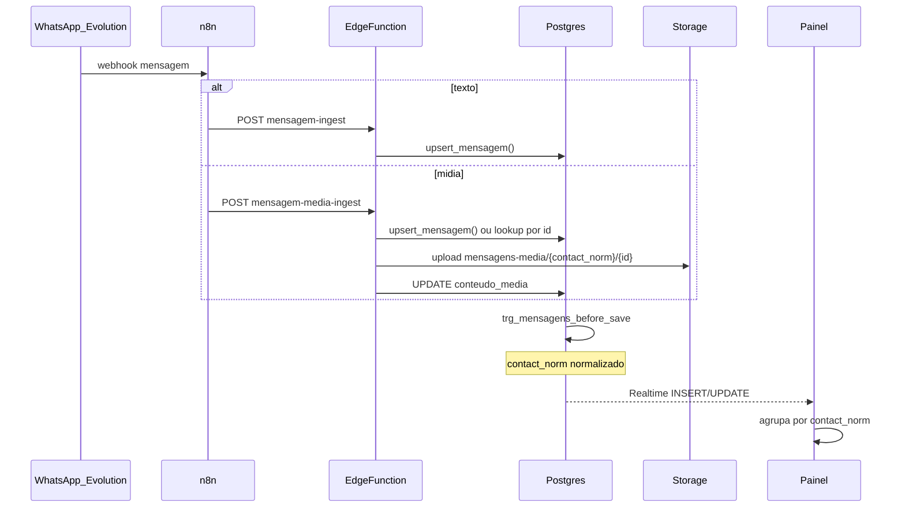
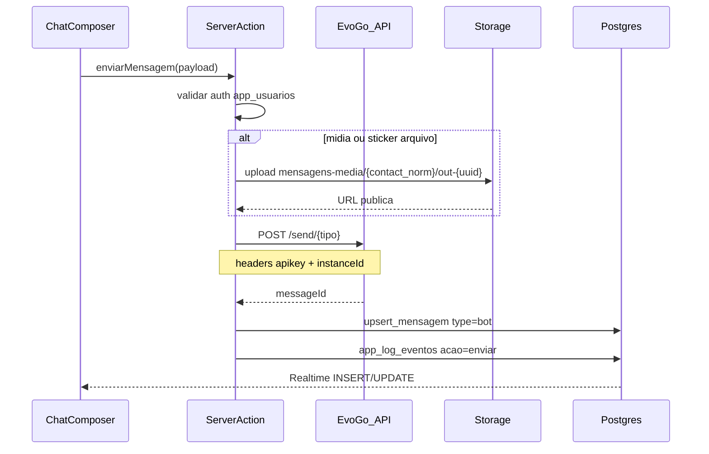

# Fluxo de Mensagens — WhatsApp → n8n → Supabase → Painel

Documentação do pipeline de ingest e envio de mensagens do projeto Hugo (`hzfvciamevimjzuvidcp`).

## Diagrama inbound (n8n)



## Diagrama outbound (painel → EvoGo)



### Server action — `enviarMensagem`

Arquivo: `lib/actions/mensagens.ts`

| Campo | Descrição |
|-------|-----------|
| `phone` | Telefone do destinatário (dígitos ou JID) |
| `contactNorm` | `contact_norm` da conversa |
| `kind` | `text`, `media`, `location`, `sticker`, `contact` |

Mensagens enviadas pelo painel usam `type: "bot"` (bolha direita, mesmo lado do agente IA).

### Endpoints EvoGo (somente estes 5)

Base: `EVOGO_API_URL` (default `https://evogo.iafeoficial.com`)

| Tipo | Endpoint | Campos principais |
|------|----------|-------------------|
| Texto | `POST /send/text` | `number`, `text` |
| Mídia | `POST /send/media` | `number`, `url`, `type`, `caption?`, `filename?` |
| Local | `POST /send/location` | `number`, `latitude`, `longitude`, `name?`, `address?` |
| Sticker | `POST /send/sticker` | `number`, `sticker` (URL) |
| Contato | `POST /send/contact` | `number`, `vcard: { fullName, phone, organization? }` |

Headers de envio: `apikey` = **token da instância** (não o GLOBAL_API_KEY), `instanceId` = UUID da instância.

O cliente resolve automaticamente via `GET /instance/all` (com `EVOGO_GLOBAL_API_KEY`) e cacheia id + token por 5 minutos. Opcionalmente defina `EVOGO_INSTANCE_ID` + `EVOGO_INSTANCE_TOKEN` no `.env.local` para pular a resolução.

### Variáveis de ambiente (outbound)

```env
EVOGO_API_URL=https://evogo.iafeoficial.com
EVOGO_GLOBAL_API_KEY=your_global_api_key
EVOGO_INSTANCE_NAME=testehulgo
SUPABASE_SERVICE_ROLE_KEY=your_service_role_key
```

**Nunca** expor `EVOGO_GLOBAL_API_KEY` nem `SUPABASE_SERVICE_ROLE_KEY` no cliente (`NEXT_PUBLIC_*`).

## Endpoints n8n (projeto Hugo)

Base URL: `https://hzfvciamevimjzuvidcp.supabase.co/functions/v1`

| Função | URL | Método | Auth |
|--------|-----|--------|------|
| Texto | `/mensagem-ingest` | POST JSON | `Authorization: Bearer <SERVICE_ROLE>` |
| Mídia | `/mensagem-media-ingest` | POST multipart | `Authorization: Bearer <SERVICE_ROLE>` |

**Nunca** commitar a `service_role` key. Configure apenas como secret no n8n.

### Body — mensagem-ingest (JSON)

```json
{
  "phone": "5519999999999@s.whatsapp.net",
  "type": "lead",
  "text": "Olá, preciso de ajuda",
  "mensagem_id": "3EB0XXXX",
  "mensage_type": "text",
  "plataforma": "whatsapp",
  "instancia": "minha-instancia",
  "session_id": "uuid-opcional"
}
```

Resposta: `{ "id": 123, "contact_norm": "5519999999999" }`

### Body — mensagem-media-ingest (multipart)

| Campo | Obrigatório | Descrição |
|-------|-------------|-----------|
| `file` | sim | Binário da mídia |
| `mensagem_row_id` | recomendado | ID da linha retornado por mensagem-ingest |
| `mensagem_id` | alternativa | ID Evolution para lookup |
| `phone` | se sem row id | Cria linha via upsert antes do upload |
| `type` | não | Default `lead` |
| `mensage_type` | não | `image`, `audio`, etc. |

## Mapeamento `type` no painel

| `type` no banco | Origem | Bolha no UI |
|-----------------|--------|-------------|
| `lead`, `human` | Cliente | Esquerda |
| `ai`, `bot` | Agente IA | Direita |

O n8n envia `type=lead` para mensagens do cliente. O painel também aceita `human` (legado).

## Funções SQL

| Função | Propósito |
|--------|-----------|
| `normalize_phone_digits(text)` | Extrai só dígitos do phone/JID |
| `resolve_mensagens_contact_norm(phone, plataforma)` | Normaliza contact_norm (WhatsApp = dígitos) |
| `upsert_mensagem(...)` | INSERT idempotente com ON CONFLICT em `mensagem_id` |
| `trg_mensagens_before_save` | Trigger BEFORE INSERT/UPDATE — padroniza phone e contact_norm |

View auxiliar: `app_conversas_resumo` — última mensagem por `contact_norm` para listas otimizadas.

## Riscos e race conditions

### Dedupe por `mensagem_id`
Duas requisições simultâneas com o mesmo `mensagem_id` são resolvidas por `ON CONFLICT DO UPDATE`. Sem `mensagem_id`, duplicatas são possíveis — **tornar obrigatório no n8n**.

### Mídia antes do texto
Se `mensagem-media-ingest` recebe `mensagem_row_id` de uma linha inexistente, retorna 404. Opções:
1. n8n chama `mensagem-ingest` primeiro e usa o `id` retornado
2. Enviar `phone` + `mensagem_id` — a função faz upsert antes do upload

### `contact_norm` drift
Phones em formatos diferentes (`55199...` vs `55199...@s.whatsapp.net`) convergem no trigger para o mesmo `contact_norm`.

### Realtime lag
O painel usa Supabase Realtime + polling de 45s como fallback.

## Melhorias futuras (sem quebrar compatibilidade)

- Tornar `mensagem_id` obrigatório no workflow n8n
- Migrar lista de conversas para query em `app_conversas_resumo`
- `lead_id` opcional quando tabela `leads` existir

## Checklist de regressão

- [ ] INSERT texto via `mensagem-ingest` → aparece no painel ≤ 60s
- [ ] INSERT mídia → `conteudo_media` preenchido com URL pública
- [ ] Dedupe: reenviar mesmo `mensagem_id` não duplica linha
- [ ] `contact_norm` igual para `55199...` e `55199...@s.whatsapp.net`
- [ ] `type=lead` renderiza bolha do cliente (esquerda)
- [ ] RLS: painel autenticado lê; anon não lê
- [ ] n8n com service_role continua funcionando

## Documentos do cliente (IA)

Ver [DOCUMENTOS-FLUXO.md](./DOCUMENTOS-FLUXO.md) — tool `registrar_documento_cliente` + tabela `documentos_cliente`.
- [ ] Gráficos visíveis em dark mode
- [ ] Sem erro de nested button no menu mobile
